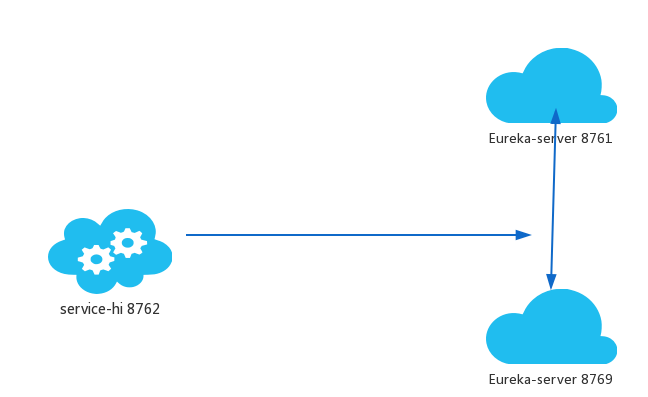

- sudo /etc/hosts，添加：
    - 127.0.0.1 peer1
    - 127.0.0.1 peer2
- 启动两个eureka-server实例，分别采用profile为peer1、peer2
- 启动eureka-client
- 访问[http://localhost:8761/](http://localhost:8761/)和[http://localhost:8762/](http://localhost:8762/)
    - 在DS Replicas一栏，展示了其它注册中心实例，即eureka-server实例之间彼此注册成功
    - 虽然eureka-client只向8761注册，但是你打开8762，你也会发现，8762也有eureka-client的注册信息

- 上图仅供参考，与实际试验操作不符，实际上采用eureka-client和eureka-server（8761、8762）