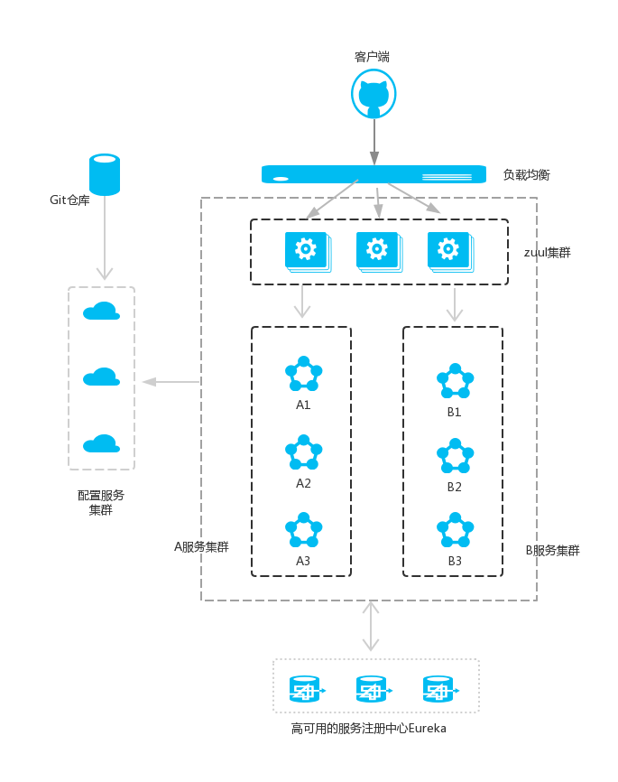

- 依次运行这五个工程;
    - 启动eureka-server
    - 启动service-hi
    - 启动service-ribbon
    - 启动service-feign
    - 启动service-zuul
- 以/api-a/ 开头的请求都转发给service-ribbon服务；以/api-b/开头的请求都转发给service-feign服务；
    - 打开浏览器访问：http://localhost:8781/api-a/hi?name=yinghuihong ;浏览器显示：
        - hi yinghuihong, i am from port: 8091
    - 打开浏览器访问：http://localhost:8781/api-b/hi?name=yinghuihong ;浏览器显示：
        - hi yinghuihong, i am from port: 8091
    - 这说明zuul起到了路由的作用
    
