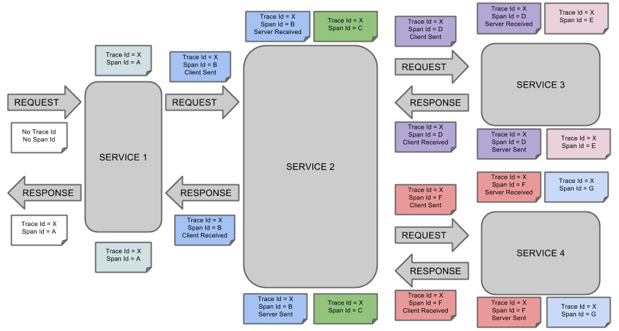

- 中间件描述
    - 在分布式系统中提供追踪解决方案
- 下载地址
    - https://dl.bintray.com/openzipkin/maven/io/zipkin/java/zipkin-server/
- 启动
    - java -jar ./zipkin-server-2.12.9-exec.jar
- 访问
    - [http://localhost:9411/](http://localhost:9411/)
    
- Span：基本工作单元，例如，在一个新建的span中发送一个RPC等同于发送一个回应请求给RPC，span通过一个64位ID唯一标识，trace以另一个64位ID表示，span还有其他数据信息，比如摘要、时间戳事件、关键值注释(tags)、span的ID、以及进度ID(通常是IP地址) span在不断的启动和停止，同时记录了时间信息，当你创建了一个span，你必须在未来的某个时刻停止它。
- Trace：一系列spans组成的一个树状结构，例如，如果你正在跑一个分布式大数据工程，你可能需要创建一个trace。
- Annotation：用来及时记录一个事件的存在，一些核心annotations用来定义一个请求的开始和结束
    - cs - Client Sent -客户端发起一个请求，这个annotion描述了这个span的开始
    - sr - Server Received -服务端获得请求并准备开始处理它，如果将其sr减去cs时间戳便可得到网络延迟
    - ss - Server Sent -注解表明请求处理的完成(当请求返回客户端)，如果ss减去sr时间戳便可得到服务端需要的处理请求时间
    - cr - Client Received -表明span的结束，客户端成功接收到服务端的回复，如果cr减去cs时间戳便可得到客户端从服务端获取回复的所有所需时间 将Span和Trace在一个系统中使用Zipkin注解的过程图形化：
- 将Span和Trace在一个系统中使用Zipkin注解的过程图形化：
